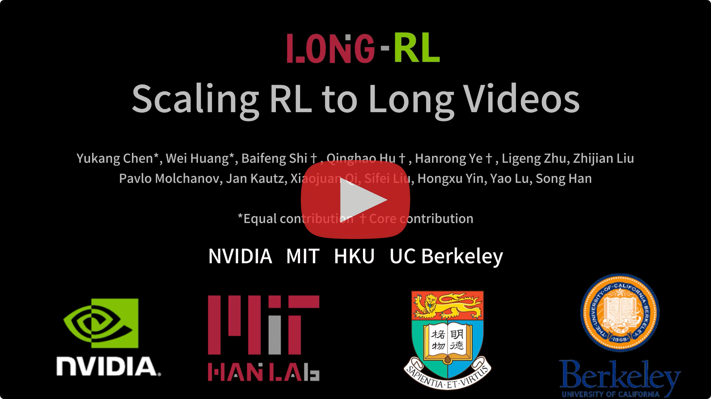
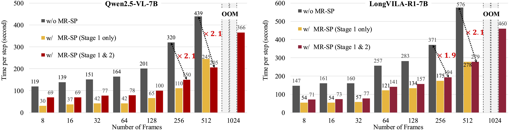
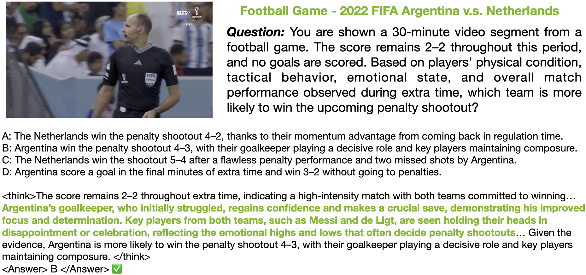
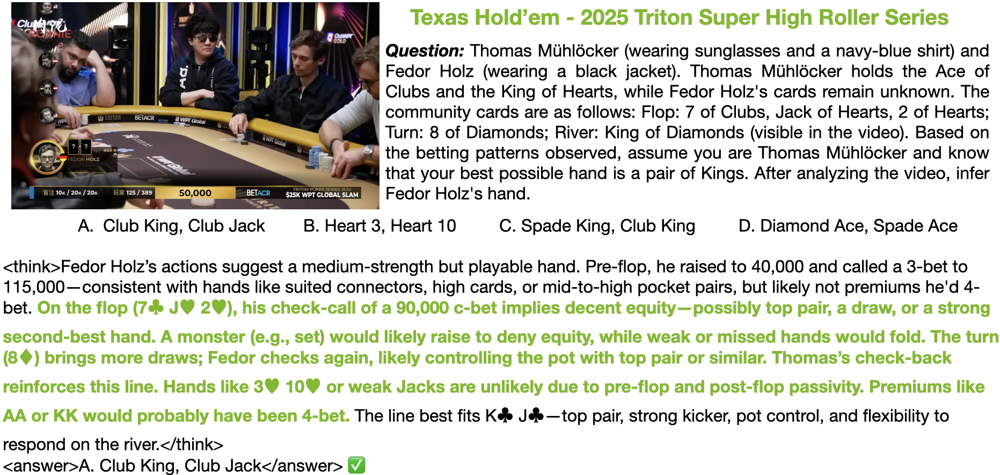
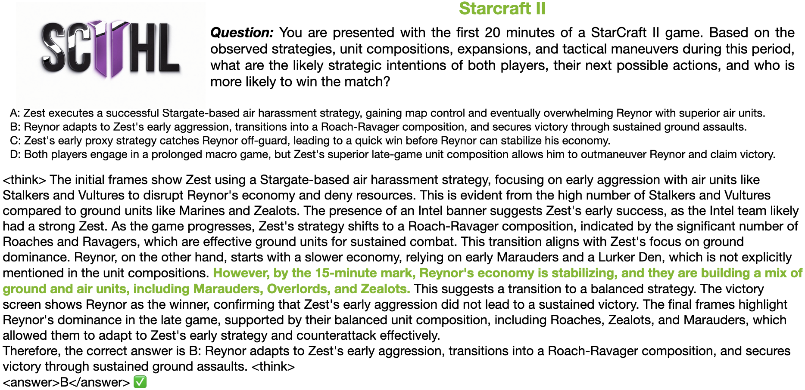
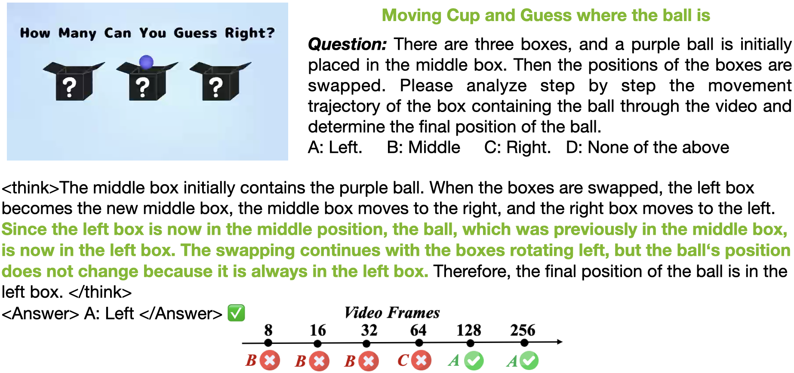

<p align="center" width="100%">

</p>

# Long-RL: Scaling RL to Long Sequences

[](https://arxiv.org/abs/2507.07966)
[](https://github.com/NVlabs/Long-RL/blob/main/LICENSE)

<div align="center">

[](https://www.youtube.com/watch?v=ykbblK2jiEg)

</div>

## TABLE OF CONTENTS
1. [News](#news)
2. [Highlights](#highlights)
3. [Introduction](#Introduction)
4. [Installation](#installation-and-quick-guide)
5. [Training](#training)
6. [Evaluation](#evaluation)
7. [Examples](#examples)
8. [How to contribute](#how-to-contribute)
9. [Core Contributors](#Core-Contributors)
10. [Citation](#citation)
11. [Acknowledgement](#acknowledgement)


## News
- [x] [2025.7.10] We release [Paper](https://arxiv.org/abs/2507.07966) and this GitHub repo [Long-RL](https://github.com/NVlabs/Long-RL).

## Highlights
1. **Hour-level long video RL training on a single node**:  We supports RL training on hour-level videos (3,600 frames - 256k tokens) with sequence parallel, on a single A100 node (8 GPUs). `examples/new_supports/qwen2_5_vl_3b_video_1h.sh`
2. **Omni-model RL**: We supports RL training on omni models, that take text, video, and audio for inputs. `examples/new_supports/qwen2_5_omni_3b_grpo.sh`
3. **Image/video generation RL**:  We supports RL training on image/video generation models, like [Stable Diffusion](https://huggingface.co/stabilityai/stable-diffusion-3.5-medium) and [Wan](https://huggingface.co/Wan-AI/Wan2.1-T2V-1.3B-Diffusers) series models. `examples/new_supports/sd3_image_grpo.sh` and `examples/new_supports/wan_video_grpo.sh`.

## Introduction
Support models:
- [x] VILA series models on image and video, with SP support
  - `examples/new_supports/nvila_2b_clevr_grpo.sh`
  - `examples/new_supports/nvila_2b_video_grpo.sh`
  - `examples/new_supports/longvila_7b_video_grpo.sh`
- [x] Qwen-VL series models on text, image, video, and audio, with SP support
  - `examples/new_supports/qwen2_5_3b_math_grpo.sh`
  - `examples/new_supports/qwen2_5_vl_3b_video_grpo.sh`
  - `examples/new_supports/qwen2_5_omni_3b_grpo.sh`
- [x] Image and video diffusion model RL
  - `examples/new_supports/sd3_image_grpo.sh`
  - `examples/new_supports/wan_video_grpo.sh`
    
Support algorithms:
- [x] In addition to GRPO, DAPO & Reinforce supported, with SP support
  - `examples/new_supports/qwen2_5_vl_3b_video_dapo.sh`
  - `examples/new_supports/qwen2_5_vl_3b_video_grpo.sh`
  - `examples/new_supports/qwen2_5_vl_3b_video_reinforce.sh`

**Scaling RL to Long Videos [[Paper](https://arxiv.org/abs/2507.07966)]** <br />
[Yukang Chen](https://yukangchen.com/), [Wei Huang](https://aaron-weihuang.com/), [Baifeng Shi](https://bfshi.github.io/), [Qinghao Hu](https://tonyhao.xyz/), [Hanrong Ye](https://sites.google.com/site/yhrspace/home), [Ligeng Zhu](https://lzhu.me/), [Zhijian Liu](https://zhijianliu.com), [Pavlo Molchanov](https://www.pmolchanov.com/), [Jan Kautz](https://jankautz.com), [Xiaojuan Qi](https://xjqi.github.io/), [Sifei Liu](https://sifeiliu.net/),[Hongxu Yin](https://hongxu-yin.github.io/), [Yao Lu](https://scholar.google.com/citations?user=OI7zFmwAAAAJ&hl=en), [Song Han](http://songhan.mit.edu/) <br />

We introduce a full-stack framework that scales up reasoning in vision-language models (VLMs) to long videos, leveraging reinforcement learning.
We addresses the unique challenges of long video reasoning by integrating three critical components: (1) a large-scale dataset, LongVideo-Reason, comprising 52K long video QA pairs with labeled high-quality reasoning annotations across diverse domains such as sports, games, and vlogs; (2) a two-stage training pipeline that extends VLMs with chain-of-thought supervised fine-tuning (CoT-SFT) and reinforcement learning (RL); and (3) a training infrastructure for long video RL, named Multi-modal Reinforcement Sequence Parallelism (MR-SP), which incorporates sequence parallelism and a vLLM-based engine tailored for long video, using cached video embeddings for efficient rollout and prefilling. Notably, our MR-SP system achieves up to 2.1x speedup on long video RL training.

<p align="center" width="100%">

</p>

## Installation

```bash
git clone https://github.com/NVlabs/Long-RL.git
cd Long-RL
pip install -e .
```
If you want to train Qwen-Omni models, please
```bash
bash vllm_replace.sh
```

## Training
### Single node
For single node (within 8 GPUs), you can refer to the training scripts in the `examples` directory. For example,
```bash
bash examples/new_supports/qwen2_5_vl_3b_video_grpo.sh $VIDEO_PATH
```

### Multi-nodes
For jobs that requires multi-nodes, you can refer to the ways mentioned in the EasyR1 repo, [here](https://github.com/hiyouga/EasyR1/tree/main?tab=readme-ov-file#how-to-run-70b-model-in-multi-node-environment).

We provide additional examples for `sbatch` scripts like, where `TRAIN_SCRIPT` is the script to train on single node, `NNODES` is the number of nodes required.
```bash
bash scripts/srun_multi_nodes.sh $TRAIN_SCRIPT $NNODES
```

For example, 
```bash
bash scripts/srun_multi_nodes.sh examples/new_supports/qwen2_5_vl_3b_video_grpo.sh 2
```

### Merge Checkpoint in Hugging Face Format
This follows the ways in the EasyR1 repo.
```bash
python3 scripts/model_merger.py --local_dir checkpoints/easy_r1/exp_name/global_step_1/actor
```

## Evaluation
We provide the instruction on evaluating models on our `LongVideo-Reason` benchmark in the `eval` [directory](https://github.com/NVlabs/Long-RL/tree/main/eval). 

## Examples
<div align="center">
<a href="https://drive.google.com/file/d/1QJ-ZsDrmYS8v1XU4eWfYu5oHuXeyGSdK/view?usp=share_link">Football Video</a>
</div>
<p align="center" width="100%">

</p>

<div align="center">
<a href="https://drive.google.com/file/d/1U0N563a2s24o_NDie1VfWauxFuSu31wC/view?usp=share_link">Texas Hold’em Video</a>
</div>
<p align="center" width="100%">

</p>

<div align="center">
<a href="https://drive.google.com/file/d/1rnF4I6-EBpqhzA0SnwyajpxbAhMezDCn/view?usp=share_link">Starcraft II Video</a>
</div>
<p align="center" width="100%">

</p>

<div align="center">
<a href="https://drive.google.com/file/d/1lo1E_bXXnMmWnFRudaSUgxMNxetEDHP9/view?usp=share_link">Moving Cup Video</a>
</div>
<p align="center" width="100%">

</p>


## How to contribute
- Make sure to have git installed.
- Create your own [fork](https://github.com/NVlabs/Long-RL/fork) of the project.
- Clone the repository on your local machine, using git clone and pasting the url of this project.
- Read both the `Installation` sections above.
- Commit and push your changes.
- Make a pull request when finished modifying the project.


## Core Contributors
[Yukang Chen](https://yukangchen.com/), [Wei Huang](https://aaron-weihuang.com/), [Shuai Yang](https://andysonys.github.io), [Qinghao Hu](https://tonyhao.xyz/), [Baifeng Shi](https://bfshi.github.io/), [Hanrong Ye](https://sites.google.com/site/yhrspace/home), [Ligeng Zhu](https://lzhu.me/).

We welcome all possible contributions and will acknowledge all contributors clearly.

## Citation
Please consider to cite our paper and this framework, if they are helpful in your research.

```bibtex
@misc{long-rl,
  title = {Long-RL: Scaling RL to Long Sequences},
  author = {Yukang Chen, Wei Huang, Shuai Yang, Qinghao Hu, Baifeng Shi, Hanrong Ye, Ligeng Zhu, Zhijian Liu, Pavlo Molchanov, Jan Kautz, Xiaojuan Qi, Sifei Liu,Hongxu Yin, Yao Lu, Song Han},
  year = {2025},
  publisher = {GitHub},
  journal = {GitHub repository},
  howpublished = {\url{https://github.com/NVlabs/Long-RL}},
}
```
```bibtex
@article{chen2025longvila-r1,
      title={Scaling RL to Long Videos},
      author={Yukang Chen and Wei Huang and Baifeng Shi and Qinghao Hu and Hanrong Ye and Ligeng Zhu and Zhijian Liu and Pavlo Molchanov and Jan Kautz and Xiaojuan Qi and Sifei Liu and Hongxu Yin and Yao Lu and Song Han},
      year={2025},
      eprint={2507.07966},
      archivePrefix={arXiv},
      primaryClass={cs.CV}
}
```
```bibtex
@inproceedings{chen2024longvila,
      title={LongVILA: Scaling Long-Context Visual Language Models for Long Videos},
      author={Yukang Chen and Fuzhao Xue and Dacheng Li and Qinghao Hu and Ligeng Zhu and Xiuyu Li and Yunhao Fang and Haotian Tang and Shang Yang and Zhijian Liu and Ethan He and Hongxu Yin and Pavlo Molchanov and Jan Kautz and Linxi Fan and Yuke Zhu and Yao Lu and Song Han},
      booktitle={The International Conference on Learning Representations (ICLR)},
      year={2025},
}
```

## Acknowledgement
- [EasyR1](https://github.com/hiyouga/EasyR1): the codebase we built upon. Thanks for their wonderful work.
- [verl](https://github.com/volcengine/verl): the RL training framework we built upon.
- [vllm](https://github.com/vllm-project/vllm): we built upon vllm for the rollout engine.
- [Flow-GRPO](https://github.com/yifan123/flow_grpo): we refer to the Flow-GRPO for the image/video generation RL part.

# Long_RL_Modified
